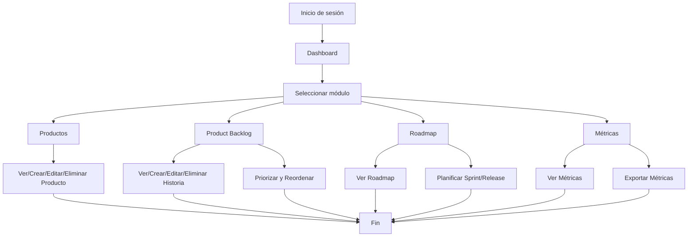

# Documento de Requisitos Funcionales

## Módulos: Productos, Product Backlog, Roadmap, Métricas

---

## 1. Módulo de Productos
### Objetivo
Gestionar los productos del sistema, permitiendo su creación, edición, visualización y eliminación.

### Requisitos Funcionales
- RF1.1: El usuario puede ver una lista de todos los productos registrados.
- RF1.2: El usuario puede crear un nuevo producto proporcionando nombre, descripción y responsable.
- RF1.3: El usuario puede editar la información de un producto existente.
- RF1.4: El usuario puede eliminar un producto (con confirmación).
- RF1.5: El usuario puede buscar productos por nombre o responsable.
- RF1.6: El sistema debe validar que el nombre del producto sea único.

---

## 2. Módulo de Product Backlog
### Objetivo
Gestionar el backlog de producto, permitiendo la administración de historias de usuario y tareas.

### Requisitos Funcionales
- RF2.1: El usuario puede ver todas las historias de usuario y tareas del backlog.
- RF2.2: El usuario puede crear nuevas historias/tareas con título, descripción, prioridad y estado.
- RF2.3: El usuario puede editar historias/tareas existentes.
- RF2.4: El usuario puede eliminar historias/tareas (con confirmación).
- RF2.5: El usuario puede priorizar y reordenar historias/tareas mediante drag & drop.
- RF2.6: El usuario puede filtrar y buscar historias/tareas por estado, prioridad o palabras clave.
- RF2.7: El sistema debe registrar la fecha de creación y última actualización de cada historia/tarea.

---

## 3. Módulo de Roadmap
### Objetivo
Visualizar y planificar la hoja de ruta del producto, mostrando releases, sprints y objetivos clave.

### Requisitos Funcionales
- RF3.1: El usuario puede ver un roadmap visual con releases, sprints y entregables.
- RF3.2: El usuario puede crear, editar y eliminar releases y sprints.
- RF3.3: El usuario puede asociar historias/tareas del backlog a un sprint o release.
- RF3.4: El usuario puede ver el estado de avance de cada sprint y release.
- RF3.5: El sistema debe permitir filtrar el roadmap por producto o rango de fechas.

---

## 4. Módulo de Métricas
### Objetivo
Proveer métricas clave del producto y del equipo para la toma de decisiones y mejora continua.

### Requisitos Funcionales
- RF4.1: El usuario puede ver métricas de velocidad, cumplimiento de sprints, historias completadas y pendientes.
- RF4.2: El usuario puede filtrar métricas por producto, sprint o rango de fechas.
- RF4.3: El sistema debe mostrar gráficos visuales (barras, líneas, pastel) para cada métrica.
- RF4.4: El usuario puede exportar métricas a formatos como CSV o PDF.
- RF4.5: El sistema debe actualizar las métricas en tiempo real o al menos tras cada cambio relevante.

---

## Requisitos Generales para Todos los Módulos
- RG1: Todos los módulos deben validar los datos de entrada y mostrar mensajes claros de error.
- RG2: El sistema debe ser responsivo y usable en dispositivos móviles y escritorio.
- RG3: Solo usuarios autenticados y con permisos adecuados pueden acceder a las funciones de cada módulo.
- RG4: Todas las acciones críticas (eliminar, cambiar estado) deben requerir confirmación del usuario.
- RG5: El sistema debe registrar logs de acciones importantes para auditoría.

---

---

## Requisitos No Funcionales

- RNF1: El sistema debe responder a cualquier acción del usuario en menos de 2 segundos bajo condiciones normales de carga.
- RNF2: La plataforma debe estar disponible al menos el 99.5% del tiempo (alta disponibilidad).
- RNF3: Todos los datos sensibles deben ser transmitidos y almacenados de forma segura (HTTPS, cifrado en base de datos).
- RNF4: El sistema debe ser escalable para soportar un crecimiento de usuarios y datos sin degradar el rendimiento.
- RNF5: La interfaz debe ser accesible cumpliendo con el estándar WCAG 2.1 AA.
- RNF6: El sistema debe permitir integración con herramientas externas mediante API RESTful.
- RNF7: El sistema debe registrar logs de errores y eventos críticos para monitoreo y auditoría.
- RNF8: El sistema debe permitir la recuperación ante fallos mediante backups automáticos diarios.

---

## Casos de Uso

### Caso de Uso 1: Crear Producto
- **Actor:** Product Owner
- **Precondición:** El usuario está autenticado y tiene permisos de Product Owner o superior.
- **Flujo principal:**
  1. El usuario accede al módulo de Productos.
  2. Hace clic en "Crear Producto".
  3. Ingresa nombre, descripción y responsable.
  4. El sistema valida los datos y crea el producto.
  5. El usuario visualiza el nuevo producto en la lista.
- **Postcondición:** El producto queda registrado y disponible para gestión.

### Caso de Uso 2: Priorizar Historia en Product Backlog
- **Actor:** Product Owner, Scrum Master
- **Precondición:** El usuario está autenticado y tiene acceso al backlog.
- **Flujo principal:**
  1. El usuario accede al módulo Product Backlog.
  2. Arrastra una historia/tarea para cambiar su prioridad.
  3. El sistema actualiza el orden y guarda los cambios.
- **Postcondición:** El backlog refleja la nueva prioridad.

### Caso de Uso 3: Visualizar Roadmap
- **Actor:** Cualquier usuario autenticado
- **Precondición:** El usuario tiene acceso a algún producto.
- **Flujo principal:**
  1. El usuario accede al módulo Roadmap.
  2. Selecciona el producto y/o rango de fechas.
  3. El sistema muestra el roadmap visual con releases y sprints.
- **Postcondición:** El usuario visualiza la hoja de ruta actualizada.

### Caso de Uso 4: Consultar Métricas
- **Actor:** Product Owner, Scrum Master, Stakeholder
- **Precondición:** El usuario está autenticado y tiene permisos para ver métricas.
- **Flujo principal:**
  1. El usuario accede al módulo de Métricas.
  2. Selecciona el producto, sprint o rango de fechas.
  3. El sistema muestra los gráficos y datos relevantes.
  4. El usuario puede exportar los datos si lo desea.
- **Postcondición:** El usuario obtiene información para la toma de decisiones.

---

---

## Diagrama de Flujo General del Proceso de Gestión

Este diagrama representa el flujo general de navegación y gestión de los módulos principales de la plataforma.
