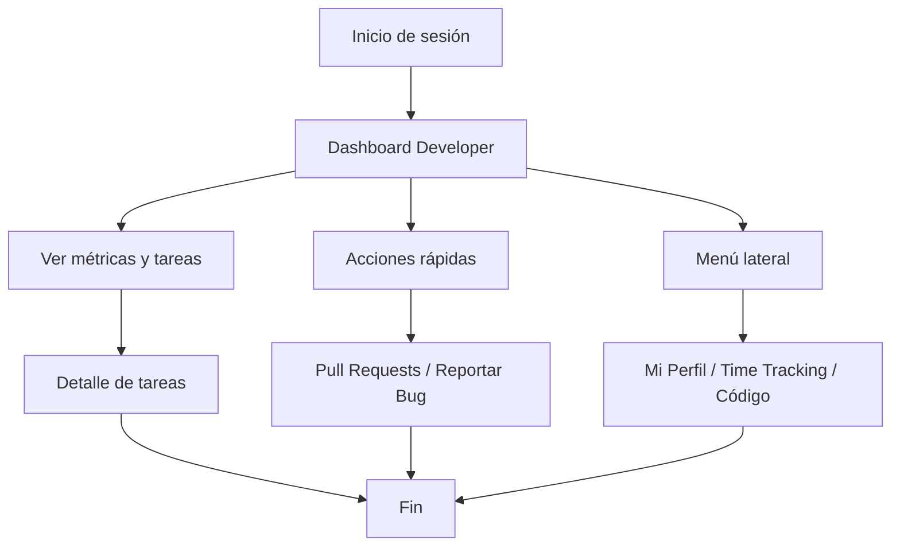

# Documento de Requisitos Funcionales

## Módulo: Panel de Developers

---

### Objetivo
Brindar a los desarrolladores una vista centralizada y operativa de sus tareas, métricas de desempeño, bugs, commits y accesos rápidos, facilitando la gestión personal y la contribución al éxito del sprint.

---

### Requisitos Funcionales
- DEV1.1: El desarrollador puede visualizar un dashboard con métricas clave: tareas asignadas, tareas completadas hoy, bugs resueltos y commits realizados en la semana.
- DEV1.2: El sistema debe mostrar indicadores visuales de progreso y variaciones respecto a días/semanas anteriores.
- DEV1.3: El desarrollador puede ver la lista de tareas asignadas para el sprint actual, con su estado (Por Hacer, En Progreso, Completado), nombre, tiempo estimado y tiempo registrado.
- DEV1.4: El sistema debe mostrar una barra de progreso para cada tarea basada en el tiempo registrado vs. estimado.
- DEV1.5: El desarrollador puede acceder a acciones rápidas: ver todas sus tareas, acceder al sprint actual, ver pull requests y reportar bugs.
- DEV1.6: El sistema debe mostrar un menú lateral con secciones: Dashboard, Mi Perfil, Mis Tareas, Sprint Board, Time Tracking y Código.
- DEV1.7: El sistema debe resaltar la sección activa en el menú y mostrar el rol actual del usuario.
- DEV1.8: El desarrollador puede cerrar sesión desde el panel.
- DEV1.9: El sistema debe mostrar mensajes claros en caso de error o ausencia de datos (por ejemplo, si no hay tareas asignadas).

---

### Requisitos Generales
- RG1: Solo usuarios autenticados con rol Developer pueden acceder a este módulo.
- RG2: El sistema debe validar los datos de entrada y mostrar mensajes claros de error.
- RG3: El sistema debe ser responsivo y usable en dispositivos móviles y escritorio.
- RG4: Todas las acciones críticas (por ejemplo, reportar bug) deben requerir confirmación del usuario.
- RG5: El sistema debe registrar logs de acciones importantes para auditoría.

---

### Requisitos No Funcionales
- RNF1: El sistema debe responder a cualquier acción del usuario en menos de 2 segundos bajo condiciones normales de carga.
- RNF2: Todos los datos sensibles deben ser transmitidos y almacenados de forma segura.
- RNF3: El sistema debe permitir integración con herramientas externas mediante API RESTful.
- RNF4: El sistema debe registrar logs de errores y eventos críticos para monitoreo y auditoría.

---

### Casos de Uso

#### Caso de Uso 1: Visualizar Dashboard de Desarrollador
- **Actor:** Developer
- **Precondición:** El usuario está autenticado como Developer.
- **Flujo principal:**
  1. El desarrollador accede al panel principal.
  2. Visualiza métricas clave (tareas asignadas, completadas, bugs, commits).
  3. El sistema muestra indicadores visuales y variaciones respecto a periodos anteriores.
- **Postcondición:** El desarrollador tiene una visión clara de su desempeño y pendientes.

#### Caso de Uso 2: Gestionar Tareas del Sprint
- **Actor:** Developer
- **Precondición:** El usuario está autenticado como Developer.
- **Flujo principal:**
  1. El desarrollador accede a la sección "Mis Tareas" o al dashboard.
  2. Visualiza la lista de tareas asignadas con su estado, nombre y tiempos.
  3. Puede consultar detalles y ver el progreso de cada tarea.
- **Postcondición:** El desarrollador conoce el estado y avance de sus tareas del sprint.

#### Caso de Uso 3: Acceder a Acciones Rápidas
- **Actor:** Developer
- **Precondición:** El usuario está autenticado como Developer.
- **Flujo principal:**
  1. El desarrollador utiliza los accesos rápidos para ver todas sus tareas, el sprint actual, pull requests o reportar un bug.
  2. El sistema redirige a la sección correspondiente.
- **Postcondición:** El desarrollador accede eficientemente a las funciones clave de su trabajo diario.

---

### Diagrama de Flujo General

Este documento cubre los requisitos funcionales, generales y no funcionales, así como los casos de uso principales para el Panel de Developers en AppScrum.
