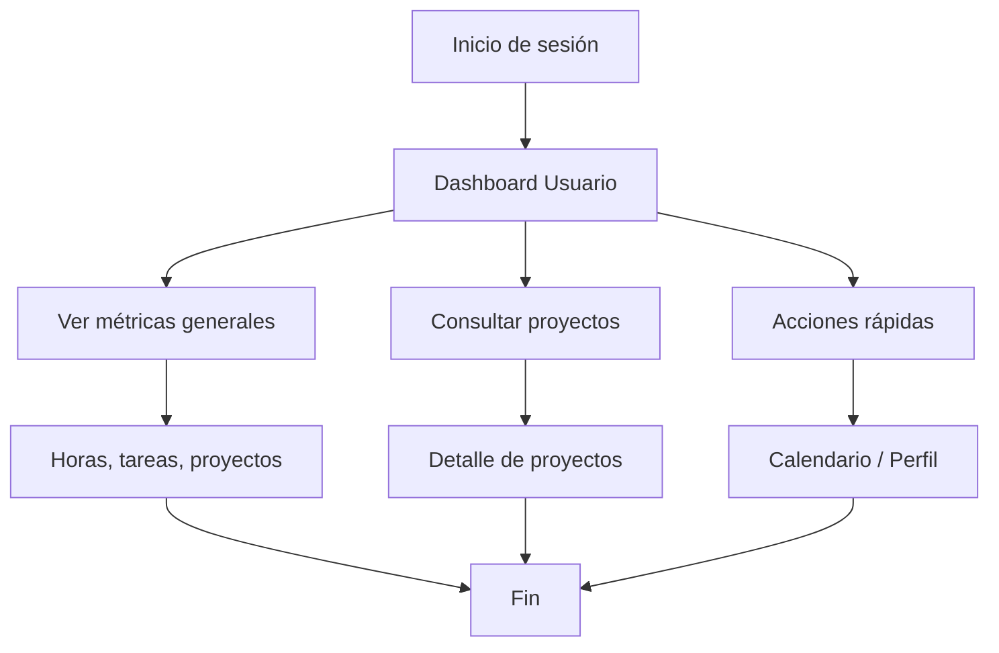

# Documento de Requisitos Funcionales

## Módulo: Panel de Usuario

---

### Objetivo
Proporcionar a los usuarios una vista centralizada y simplificada de sus proyectos, tareas pendientes, métricas de participación y accesos rápidos, facilitando el seguimiento y gestión de su trabajo desde una perspectiva de negocio y resultados.

---

### Requisitos Funcionales
- USR1.1: El usuario puede visualizar un dashboard con métricas clave: cantidad de proyectos asignados, tareas pendientes y horas trabajadas en la semana.
- USR1.2: El sistema debe mostrar indicadores visuales de variación en las horas trabajadas respecto a la semana anterior.
- USR1.3: El usuario puede ver la lista detallada de sus proyectos con nombre, equipo asignado, estado, progreso y fecha de entrega.
- USR1.4: El sistema debe mostrar estados visuales diferenciados por colores: Activo (verde), Planificación (amarillo), Completado (azul).
- USR1.5: El sistema debe mostrar una barra de progreso para cada proyecto indicando el porcentaje de avance.
- USR1.6: El usuario puede acceder a acciones rápidas: ver todos los proyectos, acceder al calendario y gestionar su perfil.
- USR1.7: El sistema debe mostrar un menú lateral simplificado con: Dashboard, Mi Perfil y Mis Actividades.
- USR1.8: El sistema debe resaltar la sección activa en el menú de navegación.
- USR1.9: El usuario puede acceder al detalle de cada proyecto desde la lista principal.
- USR1.10: El sistema debe mostrar la fecha de entrega estimada para cada proyecto.

---

### Requisitos Generales
- RG1: Solo usuarios autenticados pueden acceder a este módulo, independientemente de su rol específico.
- RG2: El sistema debe validar los datos de entrada y mostrar mensajes claros de error.
- RG3: El sistema debe ser responsivo y usable en dispositivos móviles y escritorio.
- RG4: El sistema debe mostrar mensajes informativos cuando no existan proyectos o tareas asignadas.
- RG5: El sistema debe registrar logs de acciones importantes para auditoría.

---

### Requisitos No Funcionales
- RNF1: El sistema debe responder a cualquier acción del usuario en menos de 2 segundos bajo condiciones normales de carga.
- RNF2: Todos los datos sensibles deben ser transmitidos y almacenados de forma segura.
- RNF3: El sistema debe permitir integración con herramientas externas mediante API RESTful.
- RNF4: El sistema debe registrar logs de errores y eventos críticos para monitoreo y auditoría.
- RNF5: La interfaz debe ser intuitiva y accesible para usuarios sin conocimientos técnicos avanzados.

---

### Casos de Uso

#### Caso de Uso 1: Visualizar Dashboard de Usuario
- **Actor:** Usuario (cualquier rol)
- **Precondición:** El usuario está autenticado en el sistema.
- **Flujo principal:**
  1. El usuario accede al dashboard principal.
  2. Visualiza métricas clave (proyectos, tareas pendientes, horas trabajadas).
  3. El sistema muestra indicadores de variación respecto a la semana anterior.
- **Postcondición:** El usuario tiene una visión general de su participación en proyectos.

#### Caso de Uso 2: Consultar Proyectos Asignados
- **Actor:** Usuario (cualquier rol)
- **Precondición:** El usuario está autenticado y tiene proyectos asignados.
- **Flujo principal:**
  1. El usuario visualiza la lista de proyectos en el dashboard.
  2. Consulta el estado, progreso y equipo de cada proyecto.
  3. Puede acceder al detalle de un proyecto específico.
- **Postcondición:** El usuario conoce el estado actual de sus proyectos.

#### Caso de Uso 3: Acceder a Funciones Rápidas
- **Actor:** Usuario (cualquier rol)
- **Precondición:** El usuario está autenticado en el sistema.
- **Flujo principal:**
  1. El usuario utiliza las acciones rápidas para ver proyectos, calendario o perfil.
  2. El sistema redirige a la sección correspondiente.
  3. El usuario realiza las acciones necesarias en cada sección.
- **Postcondición:** El usuario accede eficientemente a las funciones principales del sistema.

#### Caso de Uso 4: Gestionar Perfil Personal
- **Actor:** Usuario (cualquier rol)
- **Precondición:** El usuario está autenticado en el sistema.
- **Flujo principal:**
  1. El usuario accede a "Mi Perfil" desde el menú o acciones rápidas.
  2. Consulta y actualiza su información personal.
  3. El sistema valida y guarda los cambios realizados.
- **Postcondición:** La información del usuario queda actualizada en el sistema.

---

### Diagrama de Flujo General

---

### Perfiles de Usuario Objetivo

#### Product Owner
- **Uso principal:** Monitorear progreso de múltiples productos y fechas de entrega.
- **Métricas relevantes:** Proyectos activos, tareas de revisión pendientes.

#### Stakeholder/Cliente
- **Uso principal:** Consultar estado general de proyectos sin detalles técnicos.
- **Métricas relevantes:** Progreso visual, fechas de entrega, estados de proyecto.

#### Usuario de Negocio
- **Uso principal:** Seguimiento de tareas asignadas y participación en proyectos.
- **Métricas relevantes:** Horas trabajadas, tareas pendientes, calendario de actividades.

---

Este documento cubre los requisitos funcionales, generales y no funcionales, así como los casos de uso principales para el Panel de Usuario en AppScrum, diseñado para ofrecer una experiencia simplificada y orientada a resultados de negocio.
