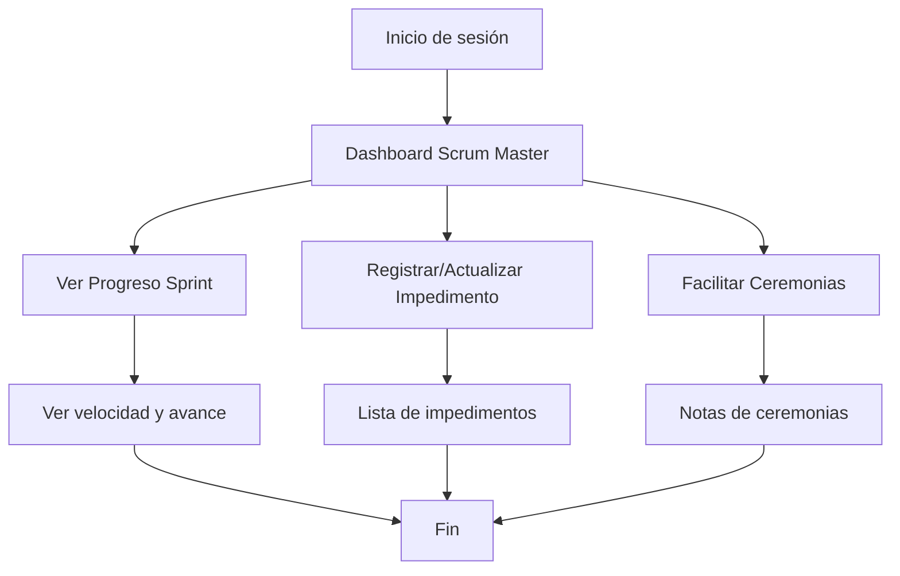

# Documento de Requisitos Funcionales

## Módulo: Scrum Master

---

### Objetivo
Facilitar la gestión y seguimiento del proceso Scrum, eliminando impedimentos, monitoreando el avance del equipo y asegurando la correcta ejecución de las ceremonias Scrum.

---

### Requisitos Funcionales
- SM1.1: El Scrum Master puede visualizar el progreso del sprint actual (porcentaje de avance, historias completadas y pendientes).
- SM1.2: El Scrum Master puede ver y registrar la velocidad del equipo (team velocity) y compararla con sprints anteriores.
- SM1.3: El Scrum Master puede registrar, actualizar y dar seguimiento a impedimentos del equipo.
- SM1.4: El Scrum Master puede ver el estado de disponibilidad de cada miembro del equipo.
- SM1.5: El Scrum Master puede iniciar y documentar ceremonias Scrum: Sprint Planning, Daily Standup, Sprint Review y Retrospectiva.
- SM1.6: El Scrum Master puede acceder a acciones rápidas para facilitar la gestión diaria del equipo.
- SM1.7: El sistema debe mostrar alertas o notificaciones sobre impedimentos críticos o retrasos en el sprint.
- SM1.8: El Scrum Master puede filtrar y buscar impedimentos por estado, responsable o fecha.
- SM1.9: El sistema debe registrar la fecha de creación y resolución de cada impedimento.
- SM1.10: El Scrum Master puede exportar reportes de impedimentos y métricas del sprint.

---

### Requisitos Generales
- RG1: Solo usuarios con rol Scrum Master pueden acceder a este módulo.
- RG2: El sistema debe validar los datos de entrada y mostrar mensajes claros de error.
- RG3: El sistema debe ser responsivo y usable en dispositivos móviles y escritorio.
- RG4: Todas las acciones críticas (eliminar, cerrar impedimento) deben requerir confirmación del usuario.
- RG5: El sistema debe registrar logs de acciones importantes para auditoría.

---

### Requisitos No Funcionales
- RNF1: El sistema debe responder a cualquier acción del usuario en menos de 2 segundos bajo condiciones normales de carga.
- RNF2: Todos los datos sensibles deben ser transmitidos y almacenados de forma segura.
- RNF3: El sistema debe permitir integración con herramientas externas mediante API RESTful.
- RNF4: El sistema debe registrar logs de errores y eventos críticos para monitoreo y auditoría.

---

### Casos de Uso

#### Caso de Uso 1: Registrar Impedimento
- **Actor:** Scrum Master
- **Precondición:** El usuario está autenticado como Scrum Master.
- **Flujo principal:**
  1. El Scrum Master accede al módulo de impedimentos.
  2. Hace clic en "Nuevo Impedimento".
  3. Ingresa título, descripción, responsable y estado.
  4. El sistema valida y registra el impedimento.
  5. El impedimento aparece en la lista y puede ser actualizado o resuelto.
- **Postcondición:** El impedimento queda registrado y visible para el equipo.

#### Caso de Uso 2: Monitorear Progreso del Sprint
- **Actor:** Scrum Master
- **Precondición:** El usuario está autenticado como Scrum Master.
- **Flujo principal:**
  1. El Scrum Master accede al dashboard.
  2. Visualiza el porcentaje de avance del sprint, velocidad del equipo y estado del equipo.
  3. El sistema muestra alertas si hay retrasos o impedimentos críticos.
- **Postcondición:** El Scrum Master tiene información actualizada para facilitar el trabajo del equipo.

#### Caso de Uso 3: Facilitar Ceremonias Scrum
- **Actor:** Scrum Master
- **Precondición:** El usuario está autenticado como Scrum Master.
- **Flujo principal:**
  1. El Scrum Master accede a acciones rápidas (Sprint Planning, Daily Standup, etc.).
  2. Documenta notas, bloqueos y acuerdos de cada ceremonia.
  3. El sistema guarda la información y la hace accesible al equipo.
- **Postcondición:** Las ceremonias quedan documentadas y disponibles para consulta.

---

### Diagrama de Flujo General

Este documento cubre los requisitos funcionales, generales y no funcionales, así como los casos de uso principales para el módulo Scrum Master en AppScrum.
